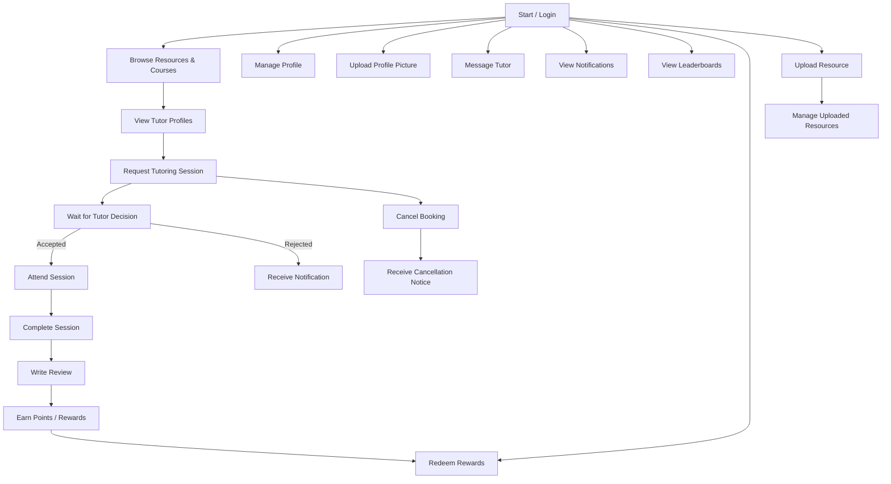
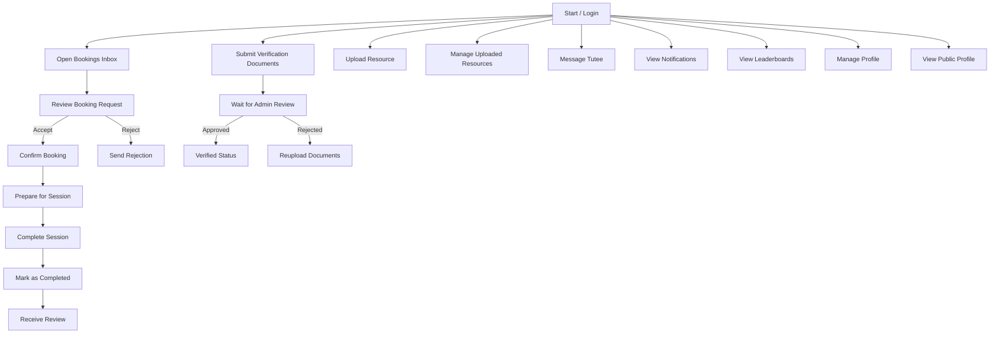
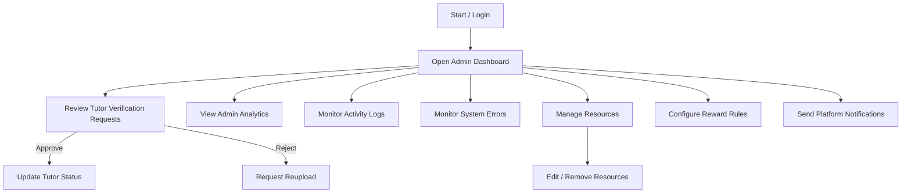

# StudyLink Activity Diagrams

## Tutee Activity Diagram

## Tutor Activity Diagram

## Admin Activity Diagram

## Notes
- The diagrams cover the main activity flows for each user role.
- Tutees focus on discovery, booking, messaging, profile management, and rewards.
- Tutors focus on booking decisions, session lifecycle, verification, and resource management.
- Admins focus on verification review, analytics, logs, errors, resource control, and rewards configuration.
