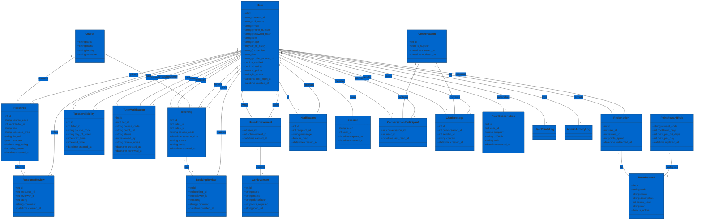

# StudyLink Class Diagram

```mermaid
%%{init: { 'theme': 'base', 'themeVariables': { 'primaryColor': '#0066cc', 'secondaryColor': '#0f4c81', 'classTextColor': '#111111' }}}%%
classDiagram
    class User {
        +int id
        +string student_id
        +string full_name
        +string email
        +string phone_number
        +string password_hash
        +string role
        +string major
        +int year_of_study
        +string[] expertise
        +string bio
        +string profile_picture_url
        +bool is_verified
        +decimal rating
        +int total_points
        +int login_streak
        +datetime last_login_at
        +datetime created_at
    }

    class Course {
        +string code
        +string name
        +string faculty
        +string semester
    }

    class Resource {
        +int id
        +string course_code
        +int contributor_id
        +string title
        +string resource_type
        +string file_url
        +json metadata
        +decimal avg_rating
        +int rating_count
        +datetime created_at
    }

    class ResourceReview {
        +int id
        +int resource_id
        +int reviewer_id
        +int rating
        +string comment
        +datetime created_at
    }

    class Booking {
        +int id
        +int tutor_id
        +int tutee_id
        +string course_code
        +datetime session_time
        +string status
        +string notes
        +datetime created_at
    }

    class BookingReview {
        +int id
        +int booking_id
        +int reviewer_id
        +int rating
        +string comment
        +datetime created_at
    }

    class TutorAvailability {
        +int id
        +int tutor_id
        +string course_code
        +string day_of_week
        +time start_time
        +time end_time
        +datetime created_at
    }

    class TutorVerification {
        +int id
        +int tutor_id
        +string course_code
        +string proof_url
        +string status
        +int reviewed_by
        +string review_notes
        +datetime created_at
        +datetime reviewed_at
    }

    class Achievement {
        +int id
        +string code
        +string name
        +string description
        +int points_required
        +string icon_url
    }

    class UserAchievement {
        +int user_id
        +int achievement_id
        +datetime earned_at
    }

    class PointReward {
        +int id
        +string code
        +string name
        +string description
        +int points_cost
        +string icon
        +bool is_active
    }

    class PointRewardRule {
        +string reward_code
        +int cooldown_days
        +int max_per_30_days
        +int max_per_day
        +datetime updated_at
    }

    class Redemption {
        +int id
        +int user_id
        +int reward_id
        +int points_spent
        +datetime redeemed_at
    }

    class Notification {
        +int id
        +int recipient_id
        +string message
        +bool is_read
        +datetime created_at
    }

    class Session {
        +string token
        +int user_id
        +datetime expires_at
        +datetime created_at
    }

    class Conversation {
        +int id
        +bool is_support
        +datetime created_at
        +datetime updated_at
    }

    class ConversationParticipant {
        +int conversation_id
        +int user_id
        +datetime last_read_at
    }

    class ChatMessage {
        +int id
        +int conversation_id
        +int sender_id
        +string content
        +datetime created_at
    }

    class PushSubscription {
        +int id
        +int user_id
        +string endpoint
        +string p256dh
        +string auth
        +datetime created_at
    }

    User "1" -- "*" Resource : uploads
    User "1" -- "*" ResourceReview : writes
    User "1" -- "*" Booking : tutors
    User "1" -- "*" Booking : tutees
    User "1" -- "*" BookingReview : reviews
    User "1" -- "*" TutorAvailability : schedules
    User "1" -- "*" TutorVerification : submits
    User "1" -- "*" Notification : receives
    User "1" -- "*" Session : owns
    User "1" -- "*" UserAchievement : earns
    User "1" -- "*" UserPointsLog : logs
    User "1" -- "*" Redemption : redeems
    User "1" -- "*" ConversationParticipant : participates
    User "1" -- "*" ChatMessage : sends
    User "1" -- "*" PushSubscription : subscribes
    User "1" -- "*" AdminActivityLog : records
    Course "1" -- "*" Resource : contains
    Course "1" -- "*" Booking : schedules
    Resource "1" -- "*" ResourceReview : rated by
    Booking "1" -- "*" BookingReview : has
    Booking "*" -- "1" User : tutor
    Booking "*" -- "1" User : tutee
    TutorAvailability "*" -- "1" User : tutor
    TutorVerification "*" -- "1" User : tutor
    TutorVerification "*" -- "1" User : reviewer
    UserAchievement "*" -- "1" User : owner
    UserAchievement "*" -- "1" Achievement : awards
    PointRewardRule "1" -- "1" PointReward : configures
    Redemption "*" -- "1" User : by
    Redemption "*" -- "1" PointReward : for
    Notification "*" -- "1" User : to
    Conversation "1" -- "*" ConversationParticipant : contains
    Conversation "1" -- "*" ChatMessage : contains
    ConversationParticipant "*" -- "1" User : member
    ChatMessage "*" -- "1" User : sender
```