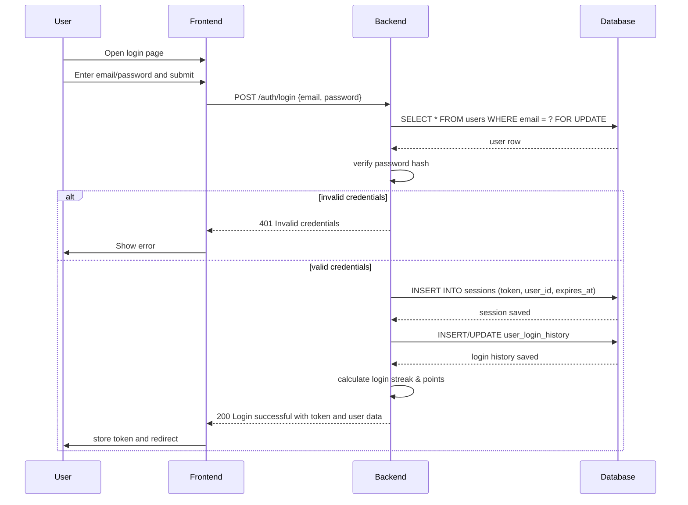
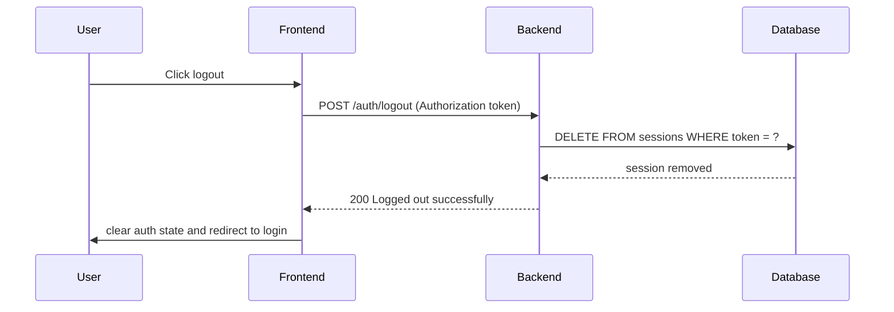
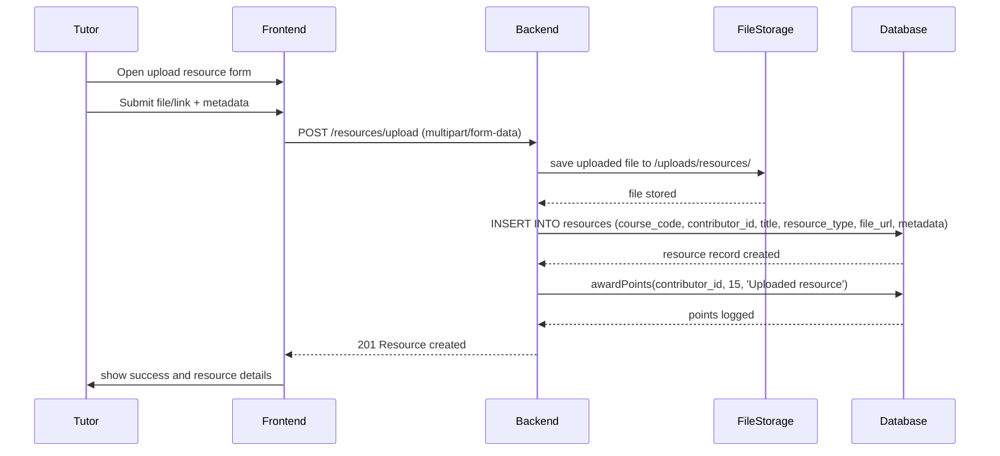
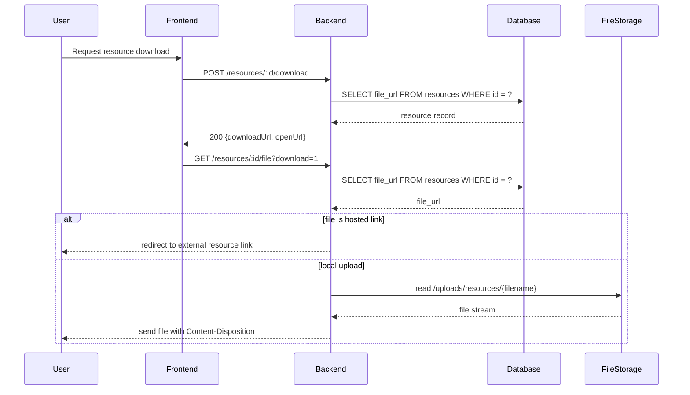
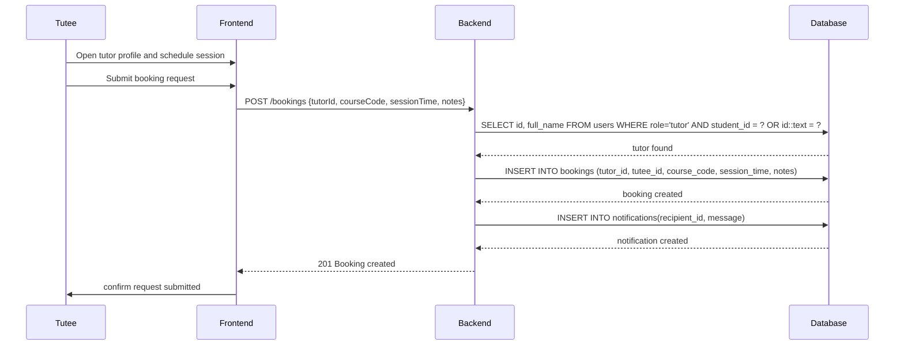
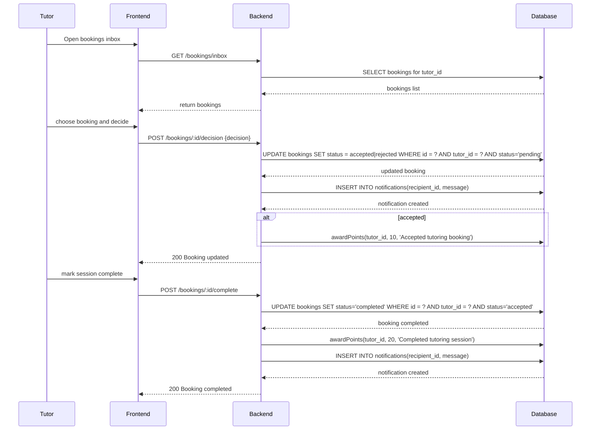
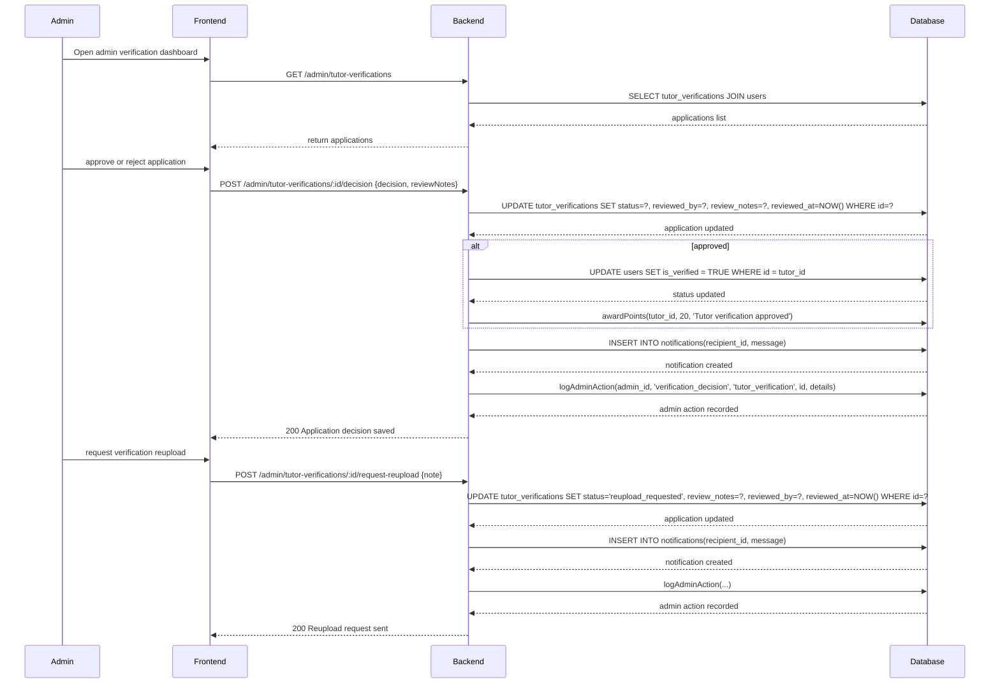
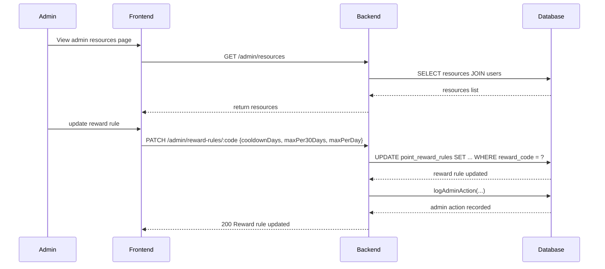
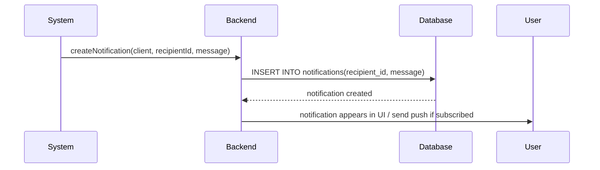

# StudyLink Sequence Diagrams

This file contains sequence diagrams for core user journeys in StudyLink.

## 1. User Login



## 2. User Logout



## 3. Centralized Resource Upload



## 4. Resource Download



## 5. Tutee Booking Session Request



## 6. Tutor Session Management



## 7. Review and Feedback System

```mermaid
sequenceDiagram
    participant Participant
    participant Frontend
    participant Backend
    participant Database

    Participant->>Frontend: Open completed booking review
    Participant->>Frontend: Submit rating/comment
    Frontend->>Backend: POST /bookings/:id/review {rating, comment}
    Backend->>Database: SELECT * FROM bookings WHERE id = ? AND status='completed'
    Database-->>Backend: booking exists
    Backend->>Backend: authorize participant
    Backend->>Database: INSERT INTO booking_reviews(booking_id, reviewer_id, rating, comment)
    Database-->>Backend: review stored
    Backend->>Database: recalculateUserRating(reviewedUserId)
    Database-->>Backend: rating updated
    Backend->>Database: awardPoints(participant_id, 8, 'Submitted tutoring session review')
    Database-->>Backend: points logged
    Backend-->>Frontend: 200 Review submitted

    Participant->>Frontend: View reviews
    Frontend->>Backend: GET /bookings/:id/reviews
    Backend->>Database: SELECT reviews JOIN users WHERE booking_id = ?
    Database-->>Backend: review rows
    Backend-->>Frontend: reviews list
```

## 8. Admin Verification and Management



## 9. Admin Resource and Reward Rule Management



## 10. Related System Flow: Notification Delivery



## Notes
- These diagrams are organized to support a combined report and emphasize the main backend-driven flows.
- The file includes login/logout, resource lifecycle, booking lifecycle, review systems, admin verification, admin management, and notification delivery.
- Additional flows like profile updates, chat messaging, or push subscription can be added later if needed.
