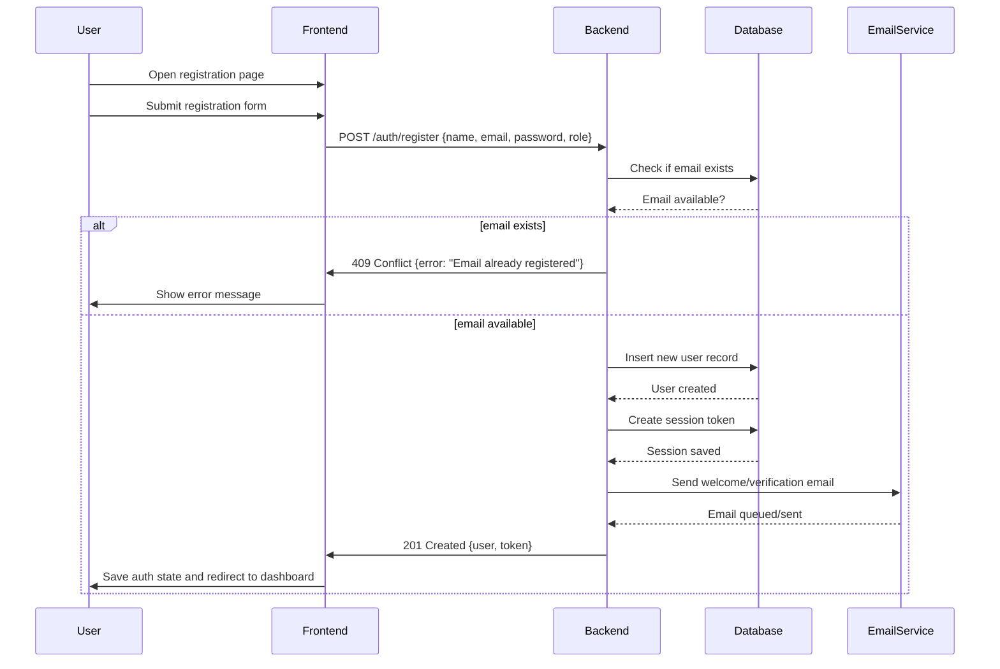

# StudyLink User Registration Sequence Diagram

## Notes
- This diagram covers the registration flow from the user submitting the form through backend validation and database persistence.
- It also includes the welcome email notification step after successful registration.
